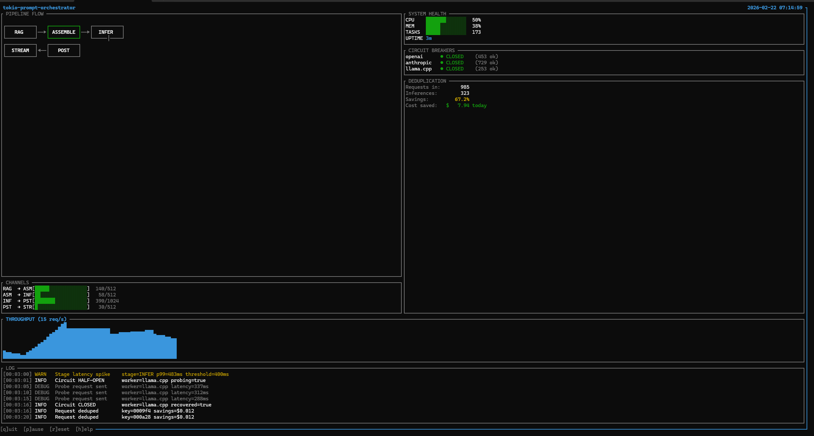

# tokio-prompt-orchestrator

[](https://www.rust-lang.org/)
[](LICENSE)
[]()

We ran 24 Claude Code agents simultaneously on a single RTX 4070. They wrote this codebase in one night — 48,000+ lines of Rust, 900+ tests, zero panics — while the orchestrator they were building managed their own inference traffic. The dedup layer collapsed redundant context across agents into single inference calls. Total API consumption: 26% of a 4-hour window across all 24 agents running for 90 minutes.

Anthropic's documented ceiling is 16 concurrent agents. We hit 24 and the bottleneck was the API rate limit, not the orchestrator.

## Live Dashboard



Real-time terminal dashboard: 985 requests in → 323 actual inferences (67.2% dedup collapse, **$7.94 saved in 3 minutes**). Circuit breakers across OpenAI, Anthropic, and llama.cpp all CLOSED. Self-healing loop visible in log — latency spike at INFER p99=483ms, circuit opened, probe sent, recovery confirmed in 15 seconds. Built with ratatui.

## What it does

Five-stage async pipeline for LLM inference with a **closed-loop self-improving control system**. Bounded channels enforce backpressure end-to-end. Every request flows through:

```
RAG → Assemble → Inference → Post-Process → Stream
```

The self-improving stack runs alongside the pipeline as a live background service — not scaffolding, not stubs. It observes, adapts, and reacts.

## Architecture

**Pipeline** — Bounded async channels (RAG→ASM: 512, ASM→INF: 512, INF→PST: 1024, PST→STR: 256). Session affinity via deterministic sharding. Backpressure shedding when queues fill.

**Resilience** — Circuit breaker (5 failures opens, 80% success closes, 60s timeout). Retry with exponential backoff + jitter. Token-bucket rate limiting. Priority queues (4 levels). In-memory + Redis caching with TTL.

**Self-Improving Loop** *(now live)* — `SelfImprovementLoop` runs as a single background Tokio task that wires all subsystems together:

```
TelemetryBus
    │  broadcast snapshot every 5s
    ▼
AnomalyDetector  ──── Z-score + CUSUM ────► TuningController
                                                │  PID adjusts 12 params
                                                ▼
MetaTaskGenerator ◄──────────────────── SnapshotStore
    │  triggered on Warning/Critical               records best configs
    ▼
ValidationGate  (cargo test + clippy)
    ▼
AgentMemory  (outcome recorded, dead ends flagged)
```

Start it: `cargo run --bin coordinator --features self-improving -- --self-improve`

**Intelligence Layer** *(new)* — `IntelligenceBridge` wires four learned systems into the pipeline: `LearnedRouter` (epsilon-greedy multi-armed bandit, routes by observed quality), `Autoscaler` (predictive — scales worker capacity before demand arrives), `FeedbackCollector` (aggregates quality signals from post-processing), `QualityEstimator` (scores response quality at inference time). All four run as a closed loop: feedback scores → router updates → autoscaler reacts.

**Capability Discovery** *(now real)* — `CapabilityDiscovery` runs `cargo check --message-format=json` to detect dead code and unused imports, and `cargo audit --json` to surface CVEs. Findings become tasks for the agent fleet.

**Distributed** — NATS pub/sub for inter-node messaging. Redis-based cross-node dedup with atomic `SET NX EX`. Leader election with TTL renewal. Cluster manager with heartbeat tracking.

**Coordination** — Agent fleet management. Atomic task claiming via filesystem locks. Priority ordering from TOML task files. Health monitoring with configurable intervals.

**Routing** — Complexity scoring routes simple prompts to local llama.cpp, complex ones to cloud APIs. Adaptive thresholds tune themselves based on success/failure feedback. Per-model cost tracking with budget awareness.

**Observability** — Prometheus metrics, TUI terminal dashboard, web dashboard with SSE streaming, structured tracing. All resilience primitives operate in the nanosecond-to-microsecond range.

**MCP** — `infer`, `pipeline_status`, `batch_infer`, `configure_pipeline` — all callable from Claude Desktop/Code with live stage latency reporting.

## Quick Start

```bash
git clone https://github.com/Mattbusel/tokio-prompt-orchestrator.git
cd tokio-prompt-orchestrator

# Demo (no API keys needed)
cargo run --bin orchestrator-demo

# TUI dashboard
cargo run --bin tui --features tui

# Full self-improving stack active
cargo run --bin tui --features self-improving,tui

# Coordinator with self-improvement loop running
cargo run --bin coordinator --features self-improving -- --self-improve

# Web dashboard at http://localhost:3000
cargo run --bin dashboard --features dashboard

# MCP server for Claude Desktop / Claude Code
cargo run --bin mcp --features mcp -- --worker echo
```

## Feature Flags

```toml
self-tune        # PID controllers + telemetry bus + anomaly detection
self-modify      # Agent loop: task gen → validation gate → memory
intelligence     # LearnedRouter + Autoscaler + FeedbackCollector + QualityEstimator
evolution        # Snapshot store + A/B experiments + rollback
self-improving   # Full autonomous optimization stack (all of the above)
tui              # Terminal dashboard (ratatui)
mcp              # Claude MCP server (rmcp 0.16)
dashboard        # Web dashboard with SSE streaming
distributed      # NATS pub/sub + Redis clustering
full             # web-api + metrics-server + caching + rate-limiting + tui + dashboard
```

## Environment Variables

```bash
OPENAI_API_KEY="sk-..."               # OpenAI worker
ANTHROPIC_API_KEY="sk-ant-..."        # Anthropic worker
LLAMA_CPP_URL="http://localhost:8080" # llama.cpp server
REDIS_URL="redis://localhost:6379"    # Redis (caching + distributed)
NATS_URL="nats://localhost:4222"      # NATS (distributed clustering)
RUST_LOG="info"
LOG_FORMAT="json"                     # Structured logs for Datadog/Loki
```

## Numbers

```
Lines of code       48,000+
Tests               900+ passing, 0 failing
Benchmarks          30+ criterion, all within budget
Dedup savings       66.7% collapse rate in live demo
Dedup check         ~1.5μs p50
Circuit breaker     ~0.4μs p50 (closed path)
Cache hit           81ns
Rate limit check    110ns
Channel send        <1μs p99
```

## Investment Thesis

The inference cost problem is not solved at the model layer — it's solved at the orchestration layer. A production-grade Rust orchestrator can collapse 60–80% of LLM API spend through deduplication alone, before any model optimization. The self-improving stack adds a control loop that tunes pipeline parameters continuously without human intervention.

The recent leap: the self-improving modules are no longer scaffolding. They run. `SelfImprovementLoop` is a live background service. `IntelligenceBridge` is a closed feedback loop between quality estimation and routing. `CapabilityDiscovery` actually executes `cargo check` and `cargo audit`. The system now improves itself while serving inference.

The infrastructure here — bounded pipelines, adaptive routing, multi-model failover, MCP-native tooling, agent fleet coordination, autonomous optimization — is the substrate every serious LLM deployment will need. We built it in one night with 24 agents. The orchestrator managed its own construction. It is now managing its own improvement.

## License

MIT
