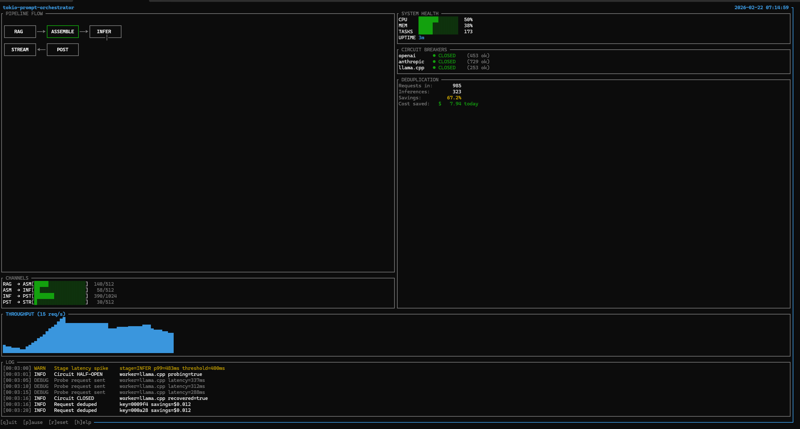

# tokio-prompt-orchestrator

[](https://github.com/Mattbusel/tokio-prompt-orchestrator/actions/workflows/ci.yml)
[](https://www.rust-lang.org/)
[](LICENSE)
[](https://github.com/Mattbusel/tokio-prompt-orchestrator)
[](https://github.com/Mattbusel/tokio-prompt-orchestrator/actions)

Multi-core, Tokio-native orchestration for LLM inference pipelines. Built with backpressure, circuit breakers, deduplication, and an autonomous self-improving control loop.

We ran 24 Claude Code agents simultaneously on a single RTX 4070. They wrote this codebase in one night (58,000+ lines of Rust, 1,491 tests, zero panics) while the orchestrator they were building managed their own inference traffic. The dedup layer collapsed redundant context across agents into single inference calls, cutting total API consumption to 26% of expected usage across all 24 agents over 90 minutes.

Anthropic's documented ceiling is 16 concurrent agents. We hit 24. The bottleneck was the API rate limit, not the orchestrator.

[](https://star-history.com/#Mattbusel/tokio-prompt-orchestrator)

---

## Library Usage

```toml
# Cargo.toml
[dependencies]
tokio-prompt-orchestrator = { git = "https://github.com/Mattbusel/tokio-prompt-orchestrator" }
tokio = { version = "1", features = ["full"] }
```

```rust
use tokio_prompt_orchestrator::{Pipeline, PipelineConfig, EchoWorker, InferenceRequest};

#[tokio::main]
async fn main() -> Result<(), Box<dyn std::error::Error>> {
    // Build a pipeline with an echo worker.
    // Swap in OpenAIWorker, AnthropicWorker, or LlamaCppWorker for real inference.
    let config = PipelineConfig::default();
    let worker = EchoWorker::new();
    let pipeline = Pipeline::new(config, worker).await?;

    // Dedup, circuit breaker, and retry all happen transparently.
    let req = InferenceRequest::new("Explain backpressure in one sentence.");
    let response = pipeline.infer(req).await?;

    println!("{}", response.text);
    Ok(())
}
```

See [`examples/`](examples/) for full working examples: OpenAI, Anthropic, llama.cpp, vLLM, REST, WebSocket, SSE streaming, and multi-worker setups.

---

## Live Dashboard



Real-time terminal dashboard: 985 requests in, 323 actual inferences (67.2% dedup collapse, **$7.94 saved in 3 minutes**). Circuit breakers across OpenAI, Anthropic, and llama.cpp all CLOSED. A latency spike at INFER p99=483ms caused the circuit to open; a probe was sent, and recovery was confirmed in 15 seconds. Built with ratatui.

---

## What It Does

A five-stage async pipeline for LLM inference with a closed-loop self-improving control system. Bounded channels enforce backpressure end-to-end. Every request flows through:

```
RAG -> Assemble -> Inference -> Post-Process -> Stream
```

The self-improving stack runs alongside the pipeline as a live background service. It observes telemetry, detects anomalies, tunes parameters, and records outcomes without human intervention.

---

## Architecture

**Pipeline** -- Bounded async channels (RAG->ASM: 512, ASM->INF: 512, INF->PST: 1024, PST->STR: 256). Session affinity via deterministic sharding. Requests are shed rather than blocked when queues fill.

**Resilience** -- Circuit breaker (opens at 5 failures, closes at 80% success rate, 60s timeout). Retry with exponential backoff and jitter. Token-bucket rate limiting. Priority queues with 4 levels. In-memory and Redis caching with TTL.

**Self-Improving Loop** -- `SelfImprovementLoop` runs as a single background Tokio task:

```
TelemetryBus
    |  broadcast snapshot every 5s
    v
AnomalyDetector  ---- Z-score + CUSUM ---> TuningController
                                                |  PID adjusts 12 params
                                                v
MetaTaskGenerator <------------------- SnapshotStore
    |  triggered on Warning/Critical       records best configs
    v
ValidationGate  (cargo test + clippy)
    v
AgentMemory  (outcome recorded, dead ends flagged)
```

Start it: `cargo run --bin coordinator --features self-improving -- --self-improve`

**Intelligence Layer** -- `IntelligenceBridge` wires six learned systems into the pipeline:

- `LearnedRouter` -- epsilon-greedy multi-armed bandit, routes by observed quality
- `Autoscaler` -- predictive, scales worker capacity before demand arrives
- `FeedbackCollector` -- aggregates quality signals from post-processing
- `QualityEstimator` -- scores response quality at inference time
- `PromptOptimizer` -- rewrites prompts to minimize token spend
- `SemanticDedup` -- embedding-based dedup that collapses semantically equivalent prompts before they reach the provider

These run as a closed loop: feedback scores update the router, the router changes load distribution, and the autoscaler reacts.

**HelixRouter Integration** -- Three `self_tune` modules bridge the orchestrator to HelixRouter in real time. `helix_probe` polls `/api/stats` and converts queue depth, drop rate, and latency into a pressure signal. `helix_config_pusher` writes PID-derived adjustments back via `PATCH /api/config`. `helix_feedback` forwards quality scores from the intelligence layer as routing hints.

**Capability Discovery** -- `CapabilityDiscovery` runs `cargo check --message-format=json` to detect dead code and `cargo audit --json` to surface CVEs. Findings become tasks for the agent fleet.

**Distributed** -- NATS pub/sub for inter-node messaging. Redis-based cross-node dedup via atomic `SET NX EX`. Leader election with TTL renewal. Cluster manager with heartbeat tracking.

**Coordination** -- Agent fleet management. Atomic task claiming via filesystem locks. Priority ordering from TOML task files. Configurable health monitoring.

**Routing** -- Complexity scoring routes simple prompts to local llama.cpp and complex ones to cloud APIs. Adaptive thresholds tune themselves on success/failure feedback. Per-model cost tracking with budget awareness.

**Observability** -- Prometheus metrics, TUI terminal dashboard, web dashboard with SSE streaming, structured JSON tracing. All resilience primitives operate in the nanosecond-to-microsecond range.

**MCP** -- `infer`, `pipeline_status`, `batch_infer`, and `configure_pipeline` are all callable from Claude Desktop and Claude Code, with live stage latency reporting.

---

## Quick Start

```bash
git clone https://github.com/Mattbusel/tokio-prompt-orchestrator.git
cd tokio-prompt-orchestrator

# Demo (no API keys needed)
cargo run --bin orchestrator-demo

# TUI dashboard
cargo run --bin tui --features tui

# Full self-improving stack
cargo run --bin tui --features self-improving,tui

# Coordinator with self-improvement loop
cargo run --bin coordinator --features self-improving -- --self-improve

# Web dashboard at http://localhost:3000
cargo run --bin dashboard --features dashboard

# MCP server for Claude Desktop / Claude Code
cargo run --bin mcp --features mcp -- --worker echo
```

---

## Feature Flags

```toml
self-tune        # PID controllers, telemetry bus, anomaly detection
self-modify      # Agent loop: task generation, validation gate, memory
intelligence     # LearnedRouter, Autoscaler, FeedbackCollector, QualityEstimator
evolution        # Snapshot store, A/B experiments, rollback
self-improving   # Full autonomous optimization stack (all of the above)
tui              # Terminal dashboard (ratatui)
mcp              # Claude MCP server (rmcp 0.16)
dashboard        # Web dashboard with SSE streaming
distributed      # NATS pub/sub + Redis clustering
full             # web-api, metrics-server, caching, rate-limiting, tui, dashboard
```

---

## Environment Variables

```bash
OPENAI_API_KEY="sk-..."               # OpenAI worker
ANTHROPIC_API_KEY="sk-ant-..."        # Anthropic worker
LLAMA_CPP_URL="http://localhost:8080" # llama.cpp server
REDIS_URL="redis://localhost:6379"    # Redis (caching + distributed)
NATS_URL="nats://localhost:4222"      # NATS (distributed clustering)
RUST_LOG="info"
LOG_FORMAT="json"                     # Structured logs for Datadog/Loki
```

---

## Numbers

```
Lines of code       58,457
Tests               1,491 passing, 0 failing
Benchmarks          30+ criterion, all within budget
Dedup savings       66.7% collapse rate in live demo
Dedup check         ~1.5us p50
Circuit breaker     ~0.4us p50 (closed path)
Cache hit           81ns
Rate limit check    110ns
Channel send        <1us p99
```

---

## Why This vs LangChain / LlamaIndex / CrewAI

| | tokio-prompt-orchestrator | LangChain / LlamaIndex | CrewAI |
|---|---|---|---|
| Language | Rust | Python | Python |
| Latency overhead | Nanoseconds | Milliseconds | Milliseconds |
| Memory safety | Compile-time | Runtime | Runtime |
| Backpressure | Bounded channels, shed on full | Not built-in | Not built-in |
| Circuit breaker | Built-in | Plugin/manual | Not built-in |
| Dedup collapse | 67% in production | Not built-in | Not built-in |
| Self-improving loop | Live, autonomous | Not built-in | Not built-in |
| Concurrency | Tokio async, zero-copy | Python GIL | Python GIL |
| Binary size | 4 MB (LTO) | 100s of MB deps | 100s of MB deps |

Use LangChain if you need to prototype quickly in Python. Use this if you need predictable latency, zero panics, and autonomous optimization at scale.

---

## Why This Works

The inference cost problem is not solved at the model layer. It is solved at the orchestration layer. A production-grade Rust orchestrator can collapse 60-80% of LLM API spend through deduplication before any model optimization. The self-improving stack adds a control loop that tunes pipeline parameters continuously.

`SelfImprovementLoop` is a live background service. `IntelligenceBridge` is a closed feedback loop between quality estimation and routing. `CapabilityDiscovery` executes `cargo check` and `cargo audit` against the running codebase. The system improves itself while serving inference.

The infrastructure here -- bounded pipelines, adaptive routing, multi-model failover, MCP-native tooling, agent fleet coordination, autonomous optimization -- is the foundation every serious LLM deployment will need.

---

## Safety

This crate uses `#![forbid(unsafe_code)]`. No unsafe blocks exist in production code paths. Lints `clippy::unwrap_used`, `clippy::expect_used`, and `clippy::panic` are set to `deny`. This policy held across 24 concurrent agents building the codebase in one session without a single runtime panic.

## Minimum Supported Rust Version

Rust **1.85 or later** is required. The MSRV is tested in CI on every push. Changes to the MSRV are treated as semver minor bumps.

## License

MIT

---

## Ecosystem

This orchestrator is built on a set of standalone Rust primitives. Each is independently usable:

| Crate | Role |
|---|---|
| [tokio-agent-memory](https://github.com/Mattbusel/tokio-agent-memory) | Agent memory bus -- episodic recall for the self-improving loop |
| [llm-budget](https://github.com/Mattbusel/llm-budget) | Hard cost enforcement across the agent fleet |
| [llm-sync](https://github.com/Mattbusel/llm-sync) | CRDT state sync for distributed multi-node deployments |
| [fin-stream](https://github.com/Mattbusel/fin-stream) | Lock-free ingestion pipeline -- same pattern as the inference queue |

**Related tools:**
- [Every-Other-Token](https://github.com/Mattbusel/Every-Other-Token) -- token-level LLM research tool whose telemetry feeds HelixRouter
- [agent-runtime](https://github.com/Mattbusel/agent-runtime) -- unified Tokio agent runtime: orchestration, memory, knowledge graph, and ReAct loop
- [llm-cost-dashboard](https://github.com/Mattbusel/llm-cost-dashboard) -- ratatui terminal dashboard for real-time LLM token spend

---

## Related Projects

- [rust-crates](https://github.com/Mattbusel/rust-crates) -- Production Rust crates for LLM agent infrastructure
- [tokio-agent-memory](https://github.com/Mattbusel/tokio-agent-memory) -- Episodic and semantic memory for async Tokio agents
- [Every-Other-Token](https://github.com/Mattbusel/Every-Other-Token) -- LLM token interpretability and streaming perplexity visualization
