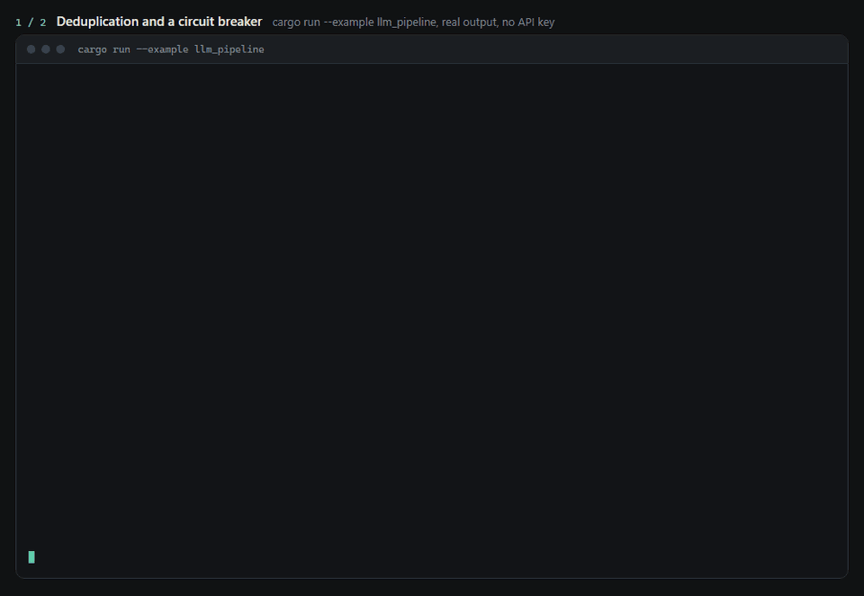
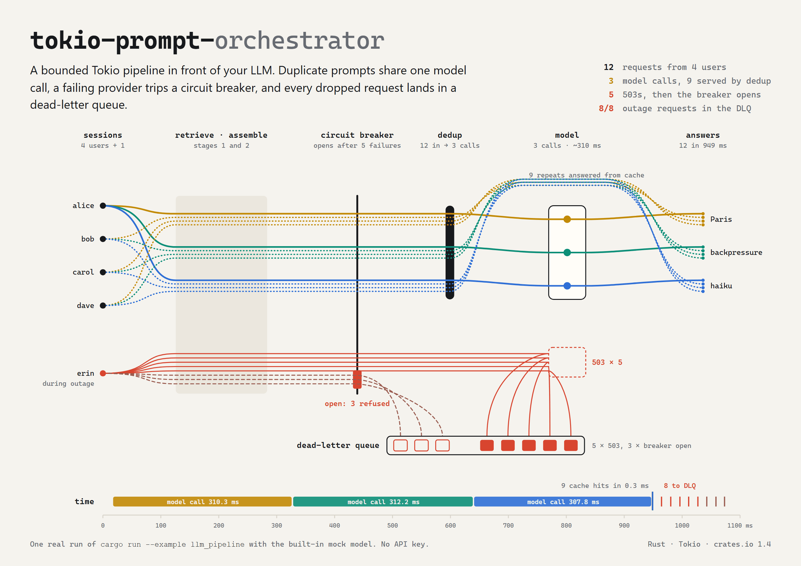

# tokio-prompt-orchestrator

**A Rust LLM request orchestrator: it sits between your app and an AI model (Anthropic, OpenAI, llama.cpp, vLLM), so the same prompt asked twice costs one model call, and when the provider goes down your requests fail fast with a clear reason instead of piling up.**

For developers who call an LLM API from an app, an agent or a script and want it to stay fast and predictable under load and during outages. Use it as a ready-made server (`orchestrator`) or as a Rust library.

<p>
  <a href="https://crates.io/crates/tokio-prompt-orchestrator"></a>
  <a href="https://docs.rs/tokio-prompt-orchestrator"></a>
  <a href="https://github.com/Mattbusel/tokio-prompt-orchestrator/releases/latest"></a>
  <a href="LICENSE"></a>
</p>



<sub>A real recording, sped up only where it was waiting. <a href="https://mattbusel.github.io/tokio-prompt-orchestrator/">The site</a> replays the same run step by step.</sub>

## Download

### [Download for Windows (.exe)](https://github.com/Mattbusel/tokio-prompt-orchestrator/releases/latest/download/orchestrator-windows-x64.exe)

Double-click it: a short setup asks for a provider (pick **echo** to try it with no key and no internet), then it runs. Windows may say "unknown publisher" because the file is unsigned: click More info, then Run anyway.

| Where | One line |
|---|---|
| **macOS / Linux** | `curl -fsSL https://gitlab.com/mattbusel/tokio-prompt-orchestrator/-/raw/main/install.sh \| sh` |
| **Windows** (PowerShell, adds it to PATH) | `irm https://gitlab.com/mattbusel/tokio-prompt-orchestrator/-/raw/main/install.ps1 \| iex` |
| Homebrew | `brew install mattbusel/tap/tokio-prompt-orchestrator` |
| Scoop | `scoop bucket add mattbusel https://github.com/Mattbusel/scoop-bucket; scoop install mattbusel/tokio-prompt-orchestrator` |
| Rust | `cargo binstall tokio-prompt-orchestrator` (prebuilt) or `cargo install tokio-prompt-orchestrator --features web-api` |
| **As a library** | `cargo add tokio-prompt-orchestrator` |

Every method installs the same `orchestrator` command. Zips and tarballs for Windows, macOS (Apple Silicon and Intel) and Linux, with `SHA256SUMS.txt`, are on the [Releases](https://github.com/Mattbusel/tokio-prompt-orchestrator/releases/latest) page.

## How it works


Each stage is its own Tokio task. A full channel never grows memory: the request is shed to the dead-letter queue with the reason, and the HTTP API answers `429` with `Retry-After`. Everything in the drawing is read from [`src/stages.rs`](src/stages.rs); more in [docs/ARCHITECTURE.md](docs/ARCHITECTURE.md).

## Examples

**1. Twelve requests, three model calls, then an outage.** `cargo run --example llm_pipeline` (no key needed), real output from today, trimmed:

```text
1) 12 requests: 4 users x 3 questions
   req-01 alice  The capital of France is Paris.
   req-02 alice  Backpressure means a slow consumer makes fast producers wait instead of letting queues grow without bound.
   ...
   req-12 dave   Bounded channels fill / the sender waits its turn now / memory stays calm
   -> 12 answers in 0.9s, 3 model calls (9 saved by dedup)

2) Provider outage: 8 new requests while every call fails
   DLQ req-13  inference_failure:inference failed: 503 Service Unavailable (simulated outage)
   ...
   DLQ req-17  inference_failure:inference failed: 503 Service Unavailable (simulated outage)
   DLQ req-18  circuit open, failed fast (provider not called)
   DLQ req-19  circuit open, failed fast (provider not called)
   DLQ req-20  circuit open, failed fast (provider not called)
   -> breaker is Open; it lets one probe through after 60s to test recovery
```

<picture>
  <source media="(prefers-color-scheme: dark)" srcset="assets/banner-dark.png">
  
</picture>

Set `PROVIDER=anthropic ANTHROPIC_API_KEY=...` or `PROVIDER=openai OPENAI_API_KEY=...` to make the same 3 calls against a real model. The source, [`examples/llm_pipeline.rs`](examples/llm_pipeline.rs), is a good template for your own backend.

**2. Any tool can use it over HTTP.** With `orchestrator --provider echo` running (echo mode answers with the prompt the pipeline built):

```bash
curl -s -X POST localhost:8080/api/v1/infer -H 'Content-Type: application/json' -d '{"prompt": "Summarize this ticket"}'
```
```json
{"request_id":"83d3b470-887f-4243-bea7-46a21276b930","status":"processing"}
```
```bash
curl -s localhost:8080/api/v1/result/83d3b470-887f-4243-bea7-46a21276b930
```
```json
{"request_id":"83d3b470-887f-4243-bea7-46a21276b930","status":"completed","result":"CONTEXT: Retrieved documents for 'Summarize this ticket' User Query: Summarize this ticket Assistant:"}
```
```bash
curl -s localhost:8080/health
```
```json
{"memory":{"rss_bytes":0,"rss_mb":0.0},"pipeline":{"circuit_breaker":{"is_open":false,"state":"closed"},"dead_letter_queue_depth":0,"inbound_queue":{"capacity":512,"depth_pct":0.0,"used":0}},"shutting_down":false,"status":"healthy","uptime_secs":4,"version":"1.4.3","worker_pool":{"pending_requests":0,"tracker_capacity":100000,"tracker_depth_pct":0.0,"tracker_used":1}}
```

**3. In your own Rust code.** [`examples/quickstart.rs`](examples/quickstart.rs), `cargo run --example quickstart`:

```rust,no_run
use std::{collections::HashMap, sync::Arc};
use tokio_prompt_orchestrator::{spawn_pipeline, EchoWorker, ModelWorker, PromptRequest, SessionId};

#[tokio::main]
async fn main() -> Result<(), Box<dyn std::error::Error>> {
    // Swap EchoWorker for AnthropicWorker, OpenAiWorker, LlamaCppWorker or VllmWorker.
    let worker: Arc<dyn ModelWorker> = Arc::new(EchoWorker::new());
    let handles = spawn_pipeline(worker);
    let mut output = handles.take_output_rx().await.ok_or("output already taken")?;

    handles.input_tx.send(PromptRequest {
        session: SessionId::new("demo"),
        request_id: "req-1".into(),
        input: "Hello, pipeline!".into(),
        meta: HashMap::new(),
        deadline: None,
    }).await?;

    let answer = output.recv().await.ok_or("pipeline closed")?;
    println!("{}", answer.text);
    for dropped in handles.dlq.drain() { println!("dropped {}: {}", dropped.request_id, dropped.reason); }
    Ok(())
}
```

```text
CONTEXT: Retrieved documents for 'Hello, pipeline!' User Query: Hello, pipeline! Assistant:
```

Needs `tokio-prompt-orchestrator = "1.4"` and `tokio = { version = "1", features = ["rt-multi-thread", "macros"] }` in `Cargo.toml`.

## Use it in 3 steps

1. **Start it.** `orchestrator --provider echo` needs no key. You get a `>` prompt in the terminal and a web address, `http://127.0.0.1:8080`.
2. **Send it prompts** from the terminal, or from any app with `POST /api/v1/infer` and `GET /api/v1/result/<id>` (example 2 above).
3. **Point it at a real model.** `orchestrator --reset` asks for a provider and key once and saves them, or pass them directly: `ANTHROPIC_API_KEY=sk-ant-... orchestrator --provider anthropic --model claude-sonnet-4-6`.

`orchestrator --help` lists every flag. If something goes wrong, see [Troubleshooting](docs/GUIDE.md#troubleshooting).

## Documentation

| Read this | For |
|---|---|
| [docs/GUIDE.md](docs/GUIDE.md) | Running the server, the HTTP API, the terminal dashboard, Claude Desktop and Claude Code (MCP), deployment, tuning, troubleshooting, all examples |
| [docs/REFERENCE.md](docs/REFERENCE.md) | Architecture, resilience building blocks, benchmarks, configuration file, environment variables, feature flags, API table, known issues |
| [docs/MODULES.md](docs/MODULES.md) | Every optional module: plugins, sessions, templates, A/B tests, semantic dedup, cache, rate limiter, cron, DLQ replay and more |
| [docs/ARCHITECTURE.md](docs/ARCHITECTURE.md), [docs/configuration.md](docs/configuration.md) | Pipeline design, every config field with its default |
| [WEB_API.md](WEB_API.md), [BENCHMARKS.md](BENCHMARKS.md), [CHANGELOG.md](CHANGELOG.md) | HTTP endpoints, benchmark runs, release notes |
| [docs.rs](https://docs.rs/tokio-prompt-orchestrator) | Full Rust API |

Contributions welcome: see [CONTRIBUTING.md](CONTRIBUTING.md). MIT licensed, see [LICENSE](LICENSE).

## Hire the author

**Need this kind of engineering on your product?** I take on a small number of client builds: LLM features, iOS apps and performance work, fixed price. [Services and pricing](https://mattbusel.github.io/) · [Email](mailto:mattbusel@gmail.com) · [LinkedIn](https://www.linkedin.com/in/matthewbusel/)
