# tokio-prompt-orchestrator

[English](README.md) | 简体中文 | [日本語](README.ja.md) | [한국어](README.ko.md)

**用 Rust 编写的大模型（LLM）请求编排器：它位于你的应用和 AI 模型（Anthropic、OpenAI、llama.cpp、vLLM）之间。同一个提示词问两次只调用一次模型；服务商宕机时，请求会快速失败（熔断）并给出明确原因，而不是越积越多。**

适合在应用、Agent 或脚本中调用 LLM API，并希望它在高负载和故障期间依然快速、可预期的开发者。既可以作为开箱即用的服务端（`orchestrator`）运行，也可以作为 Rust 库集成。

<p>
  <a href="https://crates.io/crates/tokio-prompt-orchestrator"></a>
  <a href="https://docs.rs/tokio-prompt-orchestrator"></a>
  <a href="https://gitlab.com/mattbusel/tokio-prompt-orchestrator/-/releases"></a>
  <a href="LICENSE"></a>
</p>


<sub>真实录屏，只有等待的部分做了加速。<a href="https://tokio-prompt-orchestrator.vercel.app/">项目网站</a>会一步一步回放同一次运行。</sub>

## 安装

**Linux**（x86_64，Ubuntu 20.04+ / Debian 11+）。一行命令，无需任何依赖，安装到 `~/.local/bin`：

```sh
mkdir -p ~/.local/bin && curl -fsSL https://gitlab.com/mattbusel/tokio-prompt-orchestrator/-/releases/permalink/latest/downloads/orchestrator-linux-x86_64.tar.gz | tar xz --strip-components=1 -C ~/.local/bin --wildcards '*/orchestrator'
```

| 其他系统 | |
|---|---|
| **Windows** | [下载 orchestrator-windows-x86_64.exe](https://gitlab.com/mattbusel/tokio-prompt-orchestrator/-/releases/permalink/latest/downloads/orchestrator-windows-x86_64.exe) 后直接运行。（程序未签名，SmartScreen 可能会弹出提示：先点 *更多信息*，再点 *仍要运行*。） |
| **macOS，或从源码安装** | `cargo install --locked tokio-prompt-orchestrator --features web-api,tantivy`（如需 `--semantic-dedup`，再加上 `fastembed`） |

无论哪种方式，安装的都是同一个 `orchestrator` 命令。所有版本及其 SHA-256 校验和：[Releases](https://gitlab.com/mattbusel/tokio-prompt-orchestrator/-/releases)。

## 即插即用的 OpenAI 兼容代理

任何已经在用 OpenAI 客户端的应用，无需改一行代码，就能获得请求去重、熔断器、超时、花费上限和死信队列：启动 `orchestrator`，把客户端的 base URL 指向它即可。

```sh
export OPENAI_BASE_URL=http://127.0.0.1:8080/v1
```

运行 `orchestrator --provider echo` 后（echo 模式会把你的提示词原样返回，无需 API key），直接使用官方 Python 客户端（`pip install openai`），代码不做任何修改：

```python
from openai import OpenAI

client = OpenAI()  # reads OPENAI_BASE_URL and OPENAI_API_KEY

reply = client.chat.completions.create(
    model="gpt-4o-mini",
    messages=[{"role": "user", "content": "Summarize this ticket"}],
)
print(reply.choices[0].message.content, reply.usage.total_tokens)

for chunk in client.chat.completions.create(
    model="gpt-4o-mini",
    messages=[{"role": "user", "content": "Now stream it"}],
    stream=True,
):
    if chunk.choices:
        print(chunk.choices[0].delta.content or "", end="")
print()
```
```text
Summarize this ticket 10
Now stream it
```

再用 `curl` 问一遍同样的问题，会直接从去重窗口返回答案，不会调用模型：

```bash
curl -s -i localhost:8080/v1/chat/completions -H 'Content-Type: application/json' \
  -d '{"model": "gpt-4o-mini", "messages": [{"role": "user", "content": "Summarize this ticket"}]}'
```
```text
x-orchestrator-dedup: cached
{"choices":[{"finish_reason":"stop","index":0,"logprobs":null,"message":{"content":"Summarize this ticket","refusal":null,"role":"assistant"}}],"created":1790804186,"id":"chatcmpl-4d5284a811bd4c0f90bee01018103e1a","model":"echo","object":"chat.completion","system_fingerprint":null,"usage":{"completion_tokens":5,"prompt_tokens":5,"total_tokens":10}}
```

无论请求里的 `model` 写的是什么，编排器都会用启动时指定的服务商和模型来回答（例如 `--provider openai --model gpt-4o-mini`）。错误以 OpenAI 的格式返回：熔断器打开期间返回 503，达到花费上限时返回 429。细节、认证和限制见 [docs/REFERENCE.md](docs/REFERENCE.md#openai-compatible-api)。

对于 OpenAI 模型，`usage` 中的 token 数（以及据此计算的花费上限）来自该模型自己的分词器，因此与你的 OpenAI 账单一致。其他模型按大约每 4 个字符 1 个 token 估算，上面 `echo` 的输出就是这样算出来的。

## 即插即用的 Anthropic 代理

Anthropic 客户端同理：把 base URL 指向编排器，`POST /v1/messages` 就能获得同样的去重、熔断器和花费上限。下面是官方 Python SDK，代码不做修改，连接的是 `orchestrator --provider echo`：

```python
import anthropic

client = anthropic.Anthropic(base_url="http://127.0.0.1:8080", api_key="local")
msg = client.messages.create(
    model="claude-sonnet-4-6",
    max_tokens=200,
    messages=[{"role": "user", "content": "Summarize this ticket"}],
)
print(msg.content[0].text, msg.stop_reason)

with client.messages.stream(model="claude-sonnet-4-6", max_tokens=200,
                            messages=[{"role": "user", "content": "Now stream it"}]) as s:
    print("".join(s.text_stream))
```
```text
Summarize this ticket end_turn
Now stream it
```

支持文本对话、system prompt 和流式输出；图片块和工具块会被拒绝，并返回明确的 `invalid_request_error`。API key 放在 `x-api-key` 中（与 Anthropic SDK 的发送方式一致），或放在 `Authorization: Bearer` 中。

## 基于你自己的文档回答

`orchestrator --docs ./my-docs` 会为一个文件夹里的 Markdown 和文本文件建立索引（[tantivy](https://crates.io/crates/tantivy) BM25 检索，带英文词干提取，索引在内存中），并把最相关的段落连同文件名一起放在每个问题前面。下面是用 `--provider echo` 真实运行的结果，可以清楚地看到模型实际收到的内容：

```text
  Answering from 2 passages in ./demo-docs
> How long do refunds take?
Use the following excerpts to answer. If they do not contain the answer, say so. [1] (policies/refunds.md) # Refunds Refunds are issued to the original card within 14 days of us receiving the return. Gift cards cannot be refunded. Question: How long do refunds take?
```

如果检索失败或耗时超过 2 秒，提示词会不带上下文直接发送；请求绝不会因为检索而被丢弃。在 Rust 中：`spawn_pipeline_with(worker, PipelineOptions::with_retriever(Arc::new(TantivyRetriever::index_dir("./docs")?)))`，或者为你自己的搜索系统（向量数据库、Elasticsearch、Postgres）实现 `Retriever` trait。

## 语义去重：同一个问题，换个说法

精确去重只能识别一模一样的提示词。配置 embedder 之后，OpenAI 和 Anthropic 端点还能用缓存回答换了说法的问题（`x-orchestrator-dedup: semantic`，相似度放在 `x-orchestrator-similarity` 中）。`orchestrator --semantic-dedup` 使用本地模型（[fastembed](https://crates.io/crates/fastembed)，BGE-small，无需 API key，首次使用时下载 128 MB 到你的缓存目录）；在 Rust 中，`Deduplicator::with_embedder` 既可以接收它，也可以接收 OpenAI/genai 的 embedder。

只靠向量嵌入来做这件事并不安全。用 BGE-small 实测，"Convert 10 miles to kilometers" 和 "Convert 10 kilometers to miles" 的相似度达到 0.99，比我们试过的任何真正的同义改写都高。所以一次匹配还必须满足：数字相同，并且共有的词顺序一致。在我们的测试用例（`tests/semantic_dedup_tests.rs`）上，使用默认阈值 0.93 时：

| 句对 | 相似度 | 是否复用答案 |
|---|---|---|
| "What is the capital of France?" / "Which city is the capital of France?" | 0.959 | 是 |
| "How many ounces are in a pound?" / "How many oz in one lb?" | 0.931 | 是 |
| "How do I reverse a list in Python?" / "What's the way to reverse a Python list?" | 0.985 | 否（词序不同；多花一次调用） |
| "Convert 10 miles to kilometers" / "Convert 10 kilometers to miles" | 0.992 | 否 |
| "Is 17 a prime number?" / "Is 21 a prime number?" | 0.845 | 否 |

它宁可多调用一次模型，也绝不会把别人的答案给你。调低阈值之前，请先在你自己的真实流量上检查命中情况。

## 工作原理



每个阶段都是一个独立的 Tokio 任务。通道满了也不会让内存增长：请求会连同原因被转入死信队列，HTTP API 返回 `429` 和 `Retry-After`。图中的所有内容都直接取自 [`src/stages.rs`](src/stages.rs)；更多内容见 [docs/ARCHITECTURE.md](docs/ARCHITECTURE.md)。

**应对短暂抖动的重试。** 服务商有时会出现一两秒的故障：一个 429、一个 503、一次连接中断。用 `orchestrator --retries 2` 启动（或在 pipeline 配置中设置 `retry_attempts`），这类调用在被计为失败之前，会在一段短暂、随机、且每次翻倍的等待之后重试。服务商返回的 `Retry-After` 会被遵守，错误的 API key 永远不会重试，同一个请求的所有尝试在熔断器那里只算一次。该功能默认关闭，所以上面的熔断演示与展示的效果完全一致。

**基于成熟的 crate 构建。** 那些容易在细节上出错的部分，用的是被广泛使用的开源库，而不是在这里自己写的代码：[backon](https://crates.io/crates/backon) 负责重试时机，[moka](https://crates.io/crates/moka) 用于去重缓存（它有容量上限，大量不同的提示词涌入也不会让内存无限增长），[tiktoken-rs](https://crates.io/crates/tiktoken-rs) 用于 OpenAI 的 token 计数，[prometheus](https://crates.io/crates/prometheus) 用于 `/metrics`。

## 示例

**1. 十二个请求，三次模型调用，然后遭遇故障。** `cargo run --example llm_pipeline`（无需 API key），以下是今天的真实输出，有删节：

```text
1) 12 requests: 4 users x 3 questions
   req-01 alice  The capital of France is Paris.
   req-02 alice  Backpressure means a slow consumer makes fast producers wait instead of letting queues grow without bound.
   ...
   req-12 dave   Bounded channels fill / the sender waits its turn now / memory stays calm
   -> 12 answers in 0.9s, 3 model calls (9 saved by dedup)

2) Provider outage: 8 new requests while every call fails
   DLQ req-13  inference_failure:inference failed: 503 Service Unavailable (simulated outage)
   ...
   DLQ req-17  inference_failure:inference failed: 503 Service Unavailable (simulated outage)
   DLQ req-18  circuit open, failed fast (provider not called)
   DLQ req-19  circuit open, failed fast (provider not called)
   DLQ req-20  circuit open, failed fast (provider not called)
   -> breaker is Open; it lets one probe through after 60s to test recovery
```

<picture>
  <source media="(prefers-color-scheme: dark)" srcset="assets/banner-dark.png">
  
</picture>

设置 `PROVIDER=anthropic ANTHROPIC_API_KEY=...` 或 `PROVIDER=openai OPENAI_API_KEY=...`，即可对真实模型发起同样的 3 次调用。源码 [`examples/llm_pipeline.rs`](examples/llm_pipeline.rs) 很适合拿来当作你自己后端的模板。

**2. 任何工具都能通过 HTTP 使用它。** 运行 `orchestrator --provider echo` 后（echo 模式会把提示词按模型实际收到的样子原样返回）：

```bash
curl -s -X POST localhost:8080/api/v1/infer -H 'Content-Type: application/json' -d '{"prompt": "Summarize this ticket"}'
```
```json
{"request_id":"d6a70800-99ef-4f2b-9b27-63b02af7d972","status":"processing"}
```
```bash
curl -s localhost:8080/api/v1/result/d6a70800-99ef-4f2b-9b27-63b02af7d972
```
```json
{"request_id":"d6a70800-99ef-4f2b-9b27-63b02af7d972","status":"completed","result":"Summarize this ticket"}
```
```bash
curl -s localhost:8080/health
```
```json
{"memory":{"rss_bytes":0,"rss_mb":0.0},"pipeline":{"circuit_breaker":{"is_open":false,"state":"closed"},"dead_letter_queue_depth":0,"inbound_queue":{"capacity":512,"depth_pct":0.0,"used":0}},"shutting_down":false,"status":"healthy","uptime_secs":2,"version":"2.0.0","worker_pool":{"pending_requests":0,"tracker_capacity":100000,"tracker_depth_pct":0.0,"tracker_used":1}}
```

**3. 在你自己的 Rust 代码中使用。** [`examples/quickstart.rs`](examples/quickstart.rs)，`cargo run --example quickstart`：

```rust,no_run
use std::{collections::HashMap, sync::Arc};
use tokio_prompt_orchestrator::{spawn_pipeline, EchoWorker, ModelWorker, PromptRequest, SessionId};

#[tokio::main]
async fn main() -> Result<(), Box<dyn std::error::Error>> {
    // Swap EchoWorker for AnthropicWorker, OpenAiWorker, LlamaCppWorker, VllmWorker,
    // or a worker over the client you already use (next section).
    let worker: Arc<dyn ModelWorker> = Arc::new(EchoWorker::new());
    let handles = spawn_pipeline(worker);
    let mut output = handles.take_output_rx().await.ok_or("output already taken")?;

    handles.input_tx.send(PromptRequest {
        session: SessionId::new("demo"),
        request_id: "req-1".into(),
        input: "Hello, pipeline!".into(),
        meta: HashMap::new(),
        deadline: None,
    }).await?;

    let answer = output.recv().await.ok_or("pipeline closed")?;
    println!("{}", answer.text);
    for dropped in handles.dlq.drain() { println!("dropped {}: {}", dropped.request_id, dropped.reason); }
    Ok(())
}
```

```text
Hello, pipeline!
```

需要在 `Cargo.toml` 中加入 `tokio-prompt-orchestrator = "2"` 和 `tokio = { version = "1", features = ["rt-multi-thread", "macros"] }`。

## 已经在用 async-openai、genai、rig 或 tower？

保留你现有的客户端即可。它们各自对应一个 cargo feature，可以把客户端变成一个 worker，这样请求去重、熔断器、重试、超时和死信队列就挡在你已有代码的前面。

| 你在用 | 添加 | 然后 |
|---|---|---|
| [async-openai](https://crates.io/crates/async-openai) | `features = ["async-openai"]` | `AsyncOpenAiWorker::new(client, "gpt-4o-mini")`：OpenAI、Azure，或任何 OpenAI 兼容服务（Ollama、vLLM、llama.cpp、LM Studio） |
| [genai](https://crates.io/crates/genai) | `features = ["genai"]` | `GenaiWorker::new(genai::Client::default(), "claude-sonnet-4-6")`：OpenAI、Anthropic、Gemini、Ollama、Groq、DeepSeek、xAI 等，按模型名自动选择 |
| [rig](https://crates.io/crates/rig-core) | `features = ["rig"]` | `RigWorker::new(OpenAI::from_env()?.completion("gpt-5.2"))`：任意 rig 补全模型（需要 Rust 1.95+） |
| [tower](https://crates.io/crates/tower) | `features = ["tower"]` | `ServiceWorker::new(svc)` 可以把任意 `Service<String>`（连同你的 tower layer）当作 worker 运行；`WorkerService::new(worker)` 则反过来 |

```rust,ignore
use std::sync::Arc;
use async_openai::{config::OpenAIConfig, Client};
use tokio_prompt_orchestrator::{integrations::AsyncOpenAiWorker, spawn_pipeline};

// The client you already have, here pointed at a local Ollama.
let client = Client::with_config(
    OpenAIConfig::new().with_api_base("http://localhost:11434/v1").with_api_key("ollama"),
);
let handles = spawn_pipeline(Arc::new(AsyncOpenAiWorker::new(client, "llama3.2")));
```

这四种集成都针对一个模拟的 OpenAI 服务器做了端到端测试（[`tests/integrations_tests.rs`](tests/integrations_tests.rs)）：覆盖正常回复、流式输出，以及被拒绝的 key 绝不重试、遇到 429 时退避。

### Feature flags（可选特性）

不启用任何 feature 时，这个库只包含 pipeline、各个 worker 和容错相关的部分：依赖树中共 167 个 crate。其余一切都需要手动启用。

| Feature | 提供 |
|---|---|
| `web-api` | HTTP 服务端：REST、SSE、WebSocket，以及 OpenAI 兼容的 `/v1/chat/completions` |
| `otel` | 设置了 `OTEL_EXPORTER_OTLP_ENDPOINT` 时，通过 OTLP/HTTP 导出 OpenTelemetry span |
| `tiktoken` | 精确的 OpenAI token 计数（启用 `web-api` 时自动开启） |
| `metrics-server`, `caching`, `rate-limiting` | `/metrics` 端点、Redis 结果缓存、令牌桶限流器 |
| `full` | 以上全部，外加 `cli` 和 `hot-reload` |
| `async-openai`, `genai`, `rig`, `tower` | 上文介绍的各项集成 |
| `tantivy` | `TantivyRetriever` 和 `--docs`：基于一个文件夹中的文档作答（Rust 1.90+） |
| `fastembed` | `FastEmbedder` 和 `--semantic-dedup`：用于语义去重的本地向量嵌入（Rust 1.88+；在 Windows 上需要动态 C 运行时，因此不能与 `+crt-static` 一起使用） |
| `tui`, `mcp`, `dashboard` | 终端仪表盘、供 Claude Desktop 和 Claude Code 使用的 MCP 服务器、Web 仪表盘 |
| `distributed` | 基于 Redis 的跨节点去重、NATS 工作队列、leader 选举 |
| `hot-reload`, `cli`, `schema`, `core-pinning` | 配置文件监听、`replay` 可执行程序、JSON Schema 导出、CPU 绑核 |
| `self-tune`, `self-modify`, `intelligence`, `evolution`, `self-improving` | 实验性的自调优层级 |

## 三步上手

1. **启动。** `orchestrator --provider echo` 无需 API key。终端里会出现一个 `>` 提示符，并给出一个 Web 地址：`http://127.0.0.1:8080`。
2. **发送提示词**：可以直接在终端输入，也可以从任何应用通过 `POST /api/v1/infer` 和 `GET /api/v1/result/<id>` 发送（见上面的示例 2）。
3. **接入真实模型。** `orchestrator --reset` 会询问一次服务商和 API key 并保存下来；也可以直接传入：`ANTHROPIC_API_KEY=sk-ant-... orchestrator --provider anthropic --model claude-sonnet-4-6`。

`orchestrator --help` 会列出所有参数。如果遇到问题，请查看[故障排查](docs/GUIDE.md#troubleshooting)。

## 文档

| 阅读 | 内容 |
|---|---|
| [docs/GUIDE.md](docs/GUIDE.md) | 运行服务端、HTTP API、终端仪表盘、Claude Desktop 和 Claude Code（MCP）、部署、调优、故障排查、全部示例 |
| [docs/REFERENCE.md](docs/REFERENCE.md) | 架构、容错组件、基准测试、配置文件、环境变量、feature flags、API 一览表、已知问题 |
| [docs/MODULES.md](docs/MODULES.md) | 所有可选模块：插件、会话、模板、A/B 测试、语义去重、缓存、限流器、cron 定时任务、DLQ 重放等 |
| [docs/ARCHITECTURE.md](docs/ARCHITECTURE.md), [docs/configuration.md](docs/configuration.md) | Pipeline 设计、每个配置字段及其默认值 |
| [WEB_API.md](WEB_API.md), [BENCHMARKS.md](BENCHMARKS.md), [CHANGELOG.md](CHANGELOG.md) | HTTP 端点、基准测试记录、版本更新说明 |
| [docs.rs](https://docs.rs/tokio-prompt-orchestrator) | 完整的 Rust API |

欢迎贡献：请参阅 [CONTRIBUTING.md](CONTRIBUTING.md)。采用 MIT 许可证，见 [LICENSE](LICENSE)。

## 聘请作者

**你的产品需要这类工程能力吗？** 我会承接少量客户项目：LLM 功能、iOS 应用和性能优化，固定价格。[服务与报价](https://mattbusel.vercel.app/) · [邮箱](mailto:mattbusel@gmail.com) · [LinkedIn](https://www.linkedin.com/in/matthewbusel/)
