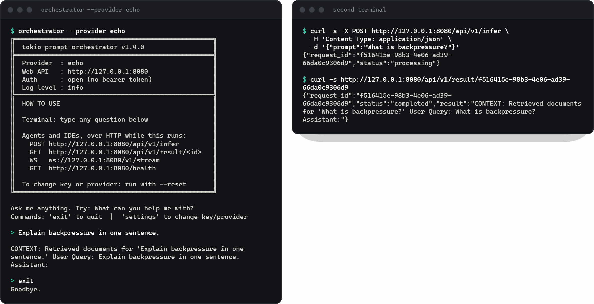
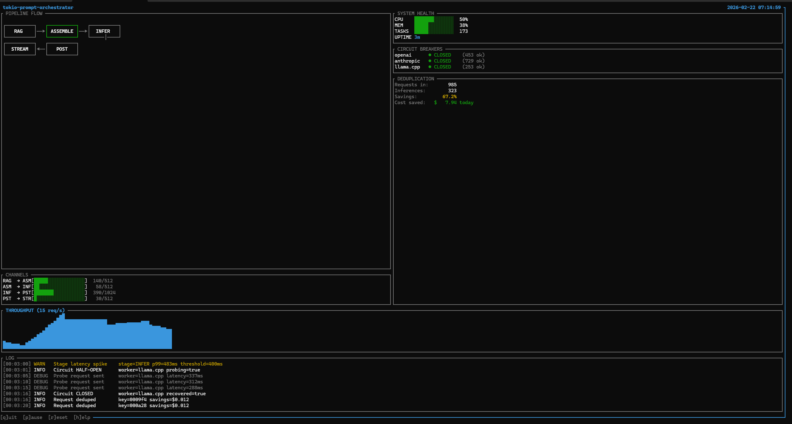
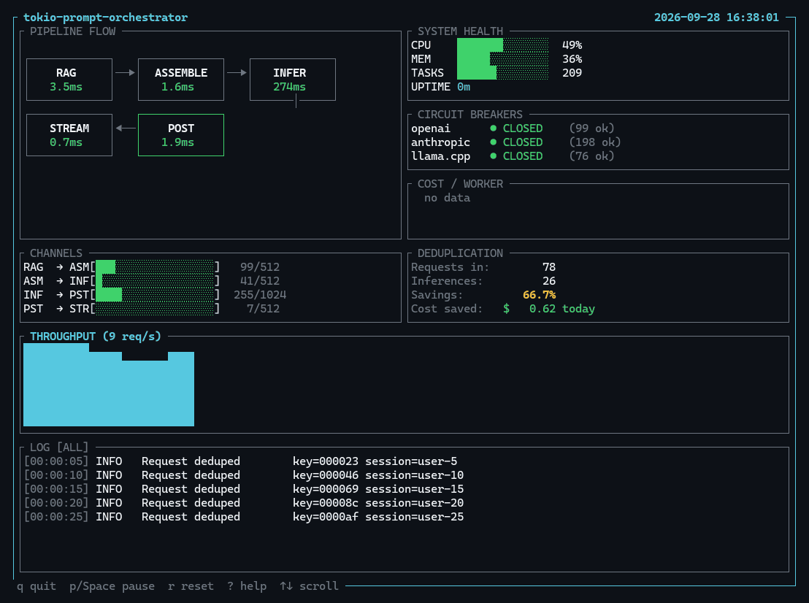

# Guide: running the server, HTTP API, dashboard and MCP

[README](../README.md) · [Guide](GUIDE.md) · [Reference](REFERENCE.md) · [Modules](MODULES.md)

## More ways to run the server (from source, full feature set, TUI)

```bash
# From a clone: terminal prompt plus the REST/WebSocket API on http://127.0.0.1:8080, offline echo mode
cargo run --features web-api -- --provider echo

# A real provider
ANTHROPIC_API_KEY=sk-ant-... cargo run --features web-api -- --provider anthropic --model claude-sonnet-4-6

# Full feature set + TUI dashboard
cargo run --features full,tui --bin tui
```



To use the library from `main` instead of the crates.io release: `tokio-prompt-orchestrator = { git = "https://gitlab.com/mattbusel/tokio-prompt-orchestrator" }`.

Without `--provider` the first launch runs a setup wizard (Anthropic, OpenAI, llama.cpp, or offline echo) and saves the choice to `orchestrator.env` next to the binary. Use 1.4.1 or later: the 1.4.0 binaries exited right after printing the banner.

## Web API

Build with `--features web-api` (the release binaries include it). Full documentation in [`WEB_API.md`](../WEB_API.md).

```bash
# Submit a prompt; returns {"request_id": "...", "status": "processing"}
curl -s -X POST http://127.0.0.1:8080/api/v1/infer \
  -H 'Content-Type: application/json' \
  -d '{"prompt": "What is backpressure?"}'

# Wait for and fetch the result
curl -s http://127.0.0.1:8080/api/v1/result/<request_id>

# Server-sent events streaming
curl -N -X POST http://127.0.0.1:8080/api/v1/stream \
  -H 'Content-Type: application/json' \
  -d '{"prompt": "What is backpressure?"}'

# WebSocket token streaming: send {"prompt": "..."}
wscat -c ws://127.0.0.1:8080/v1/stream

# Health: breaker state, queue depth, DLQ depth
curl -s http://127.0.0.1:8080/health | jq .

# Dead-letter queue inspection
curl -s http://127.0.0.1:8080/api/v1/debug/dlq | jq .
```

## Terminal dashboard

```bash
cargo run --bin tui --features tui               # mock data, for a look without a pipeline
cargo run --bin tui --features tui -- --live     # reads a running orchestrator's metrics
```





Both captures are the default mock-data mode (the animation was rendered off-screen from the crate's own `ui::draw`, see `assets/src/tui-capture/`). The dashboard shows per-stage queue depths, circuit breaker state, dedup hit rate, a throughput sparkline and a scrolling log.

## MCP integration

The `mcp` binary exposes the pipeline to Claude Desktop and Claude Code over stdio:

```bash
cargo build --release --features mcp --bin mcp
```

```json
{
  "mcpServers": {
    "tokio-prompt-orchestrator": {
      "command": "/absolute/path/to/target/release/mcp",
      "args": []
    }
  }
}
```

Setup details for both clients are in [`examples/mcp_claude_desktop.md`](../examples/mcp_claude_desktop.md).

## Deployment

### Standalone binary

```bash
cargo build --release --features full
./target/release/orchestrator --provider anthropic --model claude-sonnet-4-6
```

Flags: `--port` (default 8080), `--host` (default 127.0.0.1), `--no-web`, `--max-spend <dollars>`, `--retries <N>` (retry a model call that fails with a 429, a 5xx or a network error up to N times, with backoff; default 0), `--log-level`. Settings persist in `orchestrator.env` next to the binary. Prometheus metrics are served at `/metrics` on the web API port when built with `metrics-server`.

### Docker

A `Dockerfile` and a `docker-compose.yml` (orchestrator, Redis, NATS, Prometheus, Grafana) are in the repo, but the Dockerfile does not build a working image yet: see [#5](https://gitlab.com/mattbusel/tokio-prompt-orchestrator). A pre-built Grafana dashboard is in `grafana-dashboard.json`.

### Multi-node distributed mode

Enable the `distributed` feature and configure Redis + NATS:

```toml
[distributed]
redis_url = "redis://redis:6379"
nats_url  = "nats://nats:4222"
node_id   = "node-1"
```

All nodes share Redis for cross-node deduplication and leader election. Work distributes via NATS subjects. The coordinator binary manages cluster membership:

```bash
cargo run --features cli --bin coordinator
```

## Performance tuning

### Worker Count

Start with one worker per physical core. Increase if:
- Inference latency is high (> 5s) and you have spare cores
- Queue depths consistently > 50%

Decrease if:
- Memory pressure is high
- Provider rate limits are the bottleneck

The Autoscaler (enabled with `self-tune`) adjusts this automatically.

### Circuit Breaker

```toml
[resilience]
circuit_breaker_threshold    = 5    # failures before opening
circuit_breaker_timeout_s    = 60   # seconds before half-open probe
circuit_breaker_success_rate = 0.8  # required to close from half-open
```

For unreliable providers: lower threshold to 3, increase timeout to 120s.
For local models: increase threshold to 20 (they rarely fail, just get slow).

### Deduplication Window

```toml
[deduplication]
window_s    = 300    # cache TTL in seconds
max_entries = 10000  # max cached entries
```

Increase `window_s` for FAQ/chatbot workloads with repeated prompts.
Decrease for real-time queries where freshness matters. These settings take effect where you use `enhanced::Deduplicator` around your worker; the built-in pipeline does not deduplicate on its own.

### Channel buffer sizes

The defaults suit a cloud LLM with 1 to 10 s latency. Each stage's input channel is set in the config:

```toml
[stages.rag]
channel_capacity = 512

[stages.assemble]
channel_capacity = 512

[stages.post_process]
channel_capacity = 512

[stages.stream]
channel_capacity = 256
```

For local models (under 100 ms per call) halve them to save memory; for very slow models raise them.

## Troubleshooting

**"Circuit breaker is open."** The pipeline is protecting itself from a failing provider. `curl -s http://127.0.0.1:8080/health | jq .pipeline.circuit_breaker` shows the state; after the timeout (60 s by default) one probe goes through, and enough successes close it again.

**The dead-letter queue is growing.** Look at the reasons (`handles.dlq.drain()` or `GET /api/v1/debug/dlq`). `backpressure:<stage>` means a channel was full: raise that stage's `channel_capacity`, add inference workers, or smooth inbound traffic with the rate limiter. `inference_failure` and `inference_timeout` point at the provider.

**Dedup is not saving calls.** Dedup is keyed on the prompt text, so requests must be identical after assembly. `SemanticDeduplicator` catches near-duplicates.

**High memory usage.** Each buffered request holds its prompt. Lower the channel capacities or rate-limit inbound traffic to bound in-flight work.

**Prometheus metrics are missing.** Build with `--features metrics-server`. If `METRICS_API_KEY` is set, scrape with `Authorization: Bearer <key>`.

**The web API could not start.** Another program is using the port: pass `--port <N>`, or `--no-web` for the terminal only.

## Examples

Every file in [`examples/`](../examples/) builds in CI; the ones that call a provider need its key.

| Example | What it shows |
|---------|--------------|
| `llm_pipeline` | Dedup, circuit breaker and DLQ end to end, no key needed |
| `dedup_demo`, `circuit_breaker_demo`, `dlq_inspection` | One resilience layer at a time |
| `custom_worker`, `multi_worker` | Your own `ModelWorker`, and a pool of them |
| `anthropic_example`, `openai_example`, `llama_cpp_example`, `vllm_example` | Real providers |
| `priority_requests`, `config_hot_reload`, `metrics_demo` | Priority queue, config reload, metrics |
| `rest_api`, `sse_stream`, `websocket_api`, `web_api_demo` | The HTTP, SSE and WebSocket API (`web-api` feature) |
