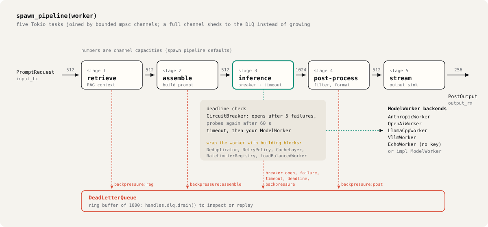

# Reference: architecture, benchmarks, configuration, API

[README](../README.md) · [Guide](GUIDE.md) · [Reference](REFERENCE.md) · [Modules](MODULES.md)

Deeper notes: [ARCHITECTURE.md](ARCHITECTURE.md), [configuration.md](configuration.md), [circuit_breaker_behavior.md](circuit_breaker_behavior.md), [distributed.md](distributed.md), [primitives.md](primitives.md).

## Architecture

<picture>
  <source media="(prefers-color-scheme: dark)" srcset="../assets/architecture-dark.svg">
  
</picture>

Each stage is its own Tokio task. When a downstream channel is full the stage sheds the request to the dead-letter queue with a `backpressure:<stage>` reason instead of blocking. Stage 3 checks the request deadline, runs the worker call through the shared circuit breaker, and enforces a timeout; failures, timeouts and breaker refusals are recorded in the DLQ too.

Deduplication, retries, caching, rate limiting and load balancing are building blocks you compose around your `ModelWorker`, the way [`examples/llm_pipeline.rs`](../examples/llm_pipeline.rs) wraps its backend in a `Deduplicator`. `spawn_pipeline_with_config` builds the same pipeline from a `PipelineConfig` (TOML), including channel capacities, breaker settings and the number of inference workers.

## What the llm_pipeline run shows

`cargo run --example llm_pipeline` (no key needed) sends 12 requests from 4 users, then simulates a provider outage:

| | What happened | Where it lives |
|---|---|---|
| **Deduplication** | 12 requests, **3 model calls**: the 9 repeats were answered from the dedup cache. 12 answers in 0.9 s | `enhanced::Deduplicator`, wrapped around the worker |
| **Circuit breaker** | After **5 failures** it opened; the next **3** requests were refused without calling the provider. It lets one probe through after 60 s | `enhanced::CircuitBreaker`, built into stage 3 |
| **Dead-letter queue** | All **8** outage requests were recorded with a reason; nothing was dropped silently | `handles.dlq`, a 1000-entry ring buffer |
| **Backpressure** | Every stage hands off through a bounded channel, so a slow model makes producers wait or shed instead of growing memory | `spawn_pipeline(worker)` |

## Resilience building blocks

| Layer | What it does |
|-------|-------------|
| **Exact-match Deduplication** | In-flight requests with identical prompts are coalesced into a single API call; all waiting callers receive the same result |
| **Semantic Deduplication** | `SemanticDeduplicator` uses 64-bit SimHash fingerprints over token-level shingles to catch near-duplicate prompts (paraphrases, punctuation variants) before they reach the model |
| **A/B Test Assignment** | `AbTestRunner` uses consistent FNV-1a hashing to map `(experiment, user_id)` pairs to variants deterministically; same user always sees same variant |
| **Circuit Breaker** | Opens on consecutive failures, enters half-open probe mode after configurable timeout |
| **Multi-provider Cascade Fallback** | `ProviderCascade` chains an ordered list of providers (primary, secondary, tertiary); open breakers are skipped automatically; per-provider latency and success-rate metrics tracked |
| **Retry + Jitter** | Exponential backoff with full jitter, prevents synchronized retry storms |
| **Rate Limiter** | Per-model sliding window plus token bucket (`rate_limiter::RateLimiterRegistry`) |
| **Dead-letter Queue** | Shed requests land in a ring buffer for inspection and replay |
| **DLQ Replay Scheduler** | `DlqReplayScheduler` re-injects DLQ entries with exponential backoff; supports per-session replay and age-based eviction |
| **Priority Queue** | Four-level priority scheduler (Critical / High / Normal / Low) with deadline-aware pop that skips expired requests |
| **Cache Layer** | TTL LRU cache for inference results (requires `caching` feature + Redis) |
| **Provider Health Dashboard** | `ProviderHealthBuilder` aggregates per-provider p50/p95 latency, 1-hour success rate, and consecutive-failure count; serialises to JSON for REST health endpoints |

## Self-improving control loop (optional)

When the `self-improving` feature is enabled, a background control loop continuously measures pipeline health and adjusts parameters:

```text
  [TelemetryBus] -> [AnomalyDetector] -> [PID Controllers] -> [Config Updates]
       |                    |                     |
  queue depths         Z-score +            worker count
  error rates          CUSUM              buffer sizes
  latency p99          alerts             retry delays

  [LearnedRouter] -> [Autoscaler] -> [PromptOptimizer] -> [A/B Experiments]
  epsilon-greedy       OLS trend        semantic dedup       snapshot rollback
  bandit               prediction       quality estimation   transfer learning
```

```bash
cargo run --bin self-improve --features self-improving
```

What it does:
1. **Monitors** queue depths, error rates, latency percentiles via TelemetryBus
2. **Detects** anomalies using Z-score and CUSUM change-point detection
3. **Tunes** worker count, buffer sizes, retry delays using PID controllers
4. **Learns** optimal routing via epsilon-greedy multi-armed bandit
5. **Optimizes** prompts by testing semantic variations and tracking quality scores
6. **Experiments** with A/B config snapshots, auto-rolls back if metrics regress

## Benchmarks

From the last recorded run in [BENCHMARKS.md](../BENCHMARKS.md) (Windows, x86_64, `EchoWorker`, so no network or model time):

| Measurement | Result |
|---|---|
| `send_with_shed` (non-blocking send with shedding) | 204 ns p50 |
| Circuit breaker check (closed) | about 0.4 µs p50 |
| Dedup check (cached) | about 1.5 µs p50 |
| Rate limiter check | 110 ns p50 |
| 1000 concurrent `EchoWorker` calls | 7.1 ms total, about 140,800 req/s |
| 100 identical concurrent prompts with dedup | 52.6 µs total, one inference |

In other words the orchestration overhead is small next to any real model call. CI records the pipeline benchmarks on every push to `main`: [benchmark history](https://mattbusel.github.io/tokio-prompt-orchestrator/dev/bench/). Run them yourself:

```bash
cargo bench --features full
```

## Configuration reference

Load a `pipeline.toml` with `config::loader::load_from_file` and pass it to `spawn_pipeline_with_config`. Check a file with `cargo run --bin validate -- --config pipeline.toml`. All fields have documented defaults; [`pipeline.example.toml`](../pipeline.example.toml) is a complete example.

> **What the pipeline applies from this file.** `spawn_pipeline_with_config` uses the channel capacities, the circuit breaker settings (`circuit_breaker_*`), the inference `timeout_ms`, the adaptive timeout and the number of inference workers. The `[deduplication]`, `[rate_limits]` and `retry_*` fields are parsed and validated, but the pipeline does not apply them by itself: wrap your `ModelWorker` in `enhanced::Deduplicator`, `enhanced::RetryPolicy` or a rate limiter to get that behaviour (see [`examples/llm_pipeline.rs`](../examples/llm_pipeline.rs)).

```toml
[pipeline]
name        = "production"
version     = "1.0"
description = "Optional human-readable description"

[stages.rag]
enabled            = true
timeout_ms         = 5000
max_context_tokens = 2048

[stages.assemble]
enabled          = true
channel_capacity = 512

[stages.inference]
worker      = "anthropic"   # anthropic | open_ai | llama_cpp | vllm | echo
model       = "claude-sonnet-4-6"
max_tokens  = 1024
temperature = 0.7
timeout_ms  = 30000

[stages.post_process]
enabled = true

[stages.stream]
enabled = true

[resilience]
retry_attempts               = 3
retry_base_ms                = 100
retry_max_ms                 = 5000
circuit_breaker_threshold    = 5
circuit_breaker_timeout_s    = 60
circuit_breaker_success_rate = 0.8

[rate_limits]
enabled             = true
requests_per_second = 100
burst_capacity      = 20

[deduplication]
enabled     = true
window_s    = 300
max_entries = 10000

[observability]
log_format       = "json"                  # pretty | json
metrics_port     = 9090                    # Prometheus scrape endpoint
tracing_endpoint = "http://jaeger:4318"    # OTLP endpoint (omit to disable)

[distributed]                              # requires "distributed" feature
redis_url = "redis://redis:6379"
nats_url  = "nats://nats:4222"
node_id   = "node-1"
```

#### Environment variables

| Variable | Purpose | Default |
|----------|---------|---------|
| `ANTHROPIC_API_KEY` | Required for `AnthropicWorker` | none |
| `OPENAI_API_KEY` | Required for `OpenAiWorker` | none |
| `LLAMA_CPP_URL` | llama.cpp server URL | `http://localhost:8080` |
| `VLLM_URL` | vLLM server URL | `http://localhost:8000` |
| `RUST_LOG` | Log level filter | `info` |
| `RUST_LOG_FORMAT` | Set to `json` for NDJSON logs | `pretty` |
| `JAEGER_ENDPOINT` | OTLP HTTP endpoint | disabled |
| `OTEL_EXPORTER_OTLP_ENDPOINT` | Alternative OTLP endpoint | disabled |
| `METRICS_API_KEY` | Bearer token to guard `/metrics` | disabled |

## Feature flags

All features are opt-in. The default build has no optional dependencies.

| Flag | Enables | Typical use |
|---|---|---|
| `web-api` | Axum HTTP/WS/SSE server | REST clients, streaming |
| `metrics-server` | Prometheus `/metrics` endpoint | Grafana dashboards |
| `tui` | Ratatui terminal dashboard | Local monitoring |
| `mcp` | Model Context Protocol server | Claude Desktop / Claude Code |
| `caching` | Redis-backed TTL result cache | Repeated-prompt workloads |
| `rate-limiting` | Token-bucket rate limiter | Provider quota management |
| `distributed` | Redis dedup + NATS pub/sub + leader election | Multi-node deployments |
| `self-tune` | PID controllers, telemetry bus, anomaly detector | Autonomous tuning |
| `self-modify` | MetaTaskGenerator, ValidationGate, AgentMemory | Config self-generation |
| `intelligence` | LearnedRouter (bandit), Autoscaler, PromptOptimizer | Learned routing |
| `evolution` | A/B experiments, snapshot rollback, transfer learning | Continuous improvement |
| `self-improving` | All self-* features combined | Full autonomous mode |
| `full` | `web-api` + `metrics-server` + `caching` + `rate-limiting` | Single-node production |
| `schema` | JSON Schema export for `PipelineConfig` | IDE validation |
| `dashboard` | Web dashboard UI | Browser monitoring |
| `core-pinning` | CPU core affinity for pipeline tasks | Latency-sensitive deployments |

## Quick API reference

| Type | Module | Description |
|------|--------|-------------|
| `PromptRequest` | `lib` | Input message sent into the pipeline |
| `SessionId` | `lib` | Session identifier for affinity sharding |
| `OrchestratorError` | `lib` | Crate-level error enum |
| `ModelWorker` | `worker` | Async trait implemented by all inference backends |
| `EchoWorker` | `worker` | Returns prompt words as tokens, for testing, no API key |
| `OpenAiWorker` | `worker` | OpenAI chat completions API |
| `AnthropicWorker` | `worker` | Anthropic Messages API |
| `LlamaCppWorker` | `worker` | Local llama.cpp HTTP server |
| `VllmWorker` | `worker` | vLLM inference server |
| `LoadBalancedWorker` | `worker` | Round-robin or least-loaded pool of workers |
| `spawn_pipeline` | `stages` | Launch the five-stage pipeline, return channel handles |
| `spawn_pipeline_with_config` | `stages` | Same, with a full `PipelineConfig` |
| `PipelineConfig` | `config` | TOML-deserialisable root configuration type |
| `CircuitBreaker` | `enhanced` | Failure-rate circuit breaker |
| `Deduplicator` | `enhanced` | In-flight request coalescer |
| `RetryPolicy` | `enhanced` | Exponential backoff with jitter |
| `CacheLayer` | `enhanced` | TTL LRU cache for inference results |
| `PriorityQueue` | `enhanced` | Four-level priority scheduler |
| `SmartBatcher` | `enhanced::smart_batch` | Adaptive micro-batching with prefix grouping |
| `TournamentRunner` | `enhanced::tournament` | Multi-provider quality tournament |
| `SessionContext` | `session` | Multi-turn conversation history manager |
| `DeadLetterQueue` | `lib` | Ring buffer of shed requests |
| `send_with_shed` | `lib` | Non-blocking channel send with graceful shedding |
| `shard_session` | `lib` | FNV-1a session affinity shard helper |

## Known issues and roadmap

- **prometheus 0.13**: Has RUSTSEC-2024-0437 (protobuf DoS). Mitigated by API key auth on `/metrics`. Migration to 0.14 blocked by `prometheus::proto` API removal, tracked internally for Q3 2026.
- **Request replay UI**: Dead-letter queue replay works via API; a TUI panel for it is planned.
- **Per-stage circuit breaker metrics**: Currently aggregated; per-stage breakdown is planned.
- **PromptGuard embedding mode**: Current detection is lexical (no external deps). A future optional mode will use local embedding models for semantic similarity detection.
- **ArbitrageEngine + circuit breaker integration**: A future release will auto-exclude circuit-breaker-open providers from the arbitrage candidate set.
- **PoolSizer and pipeline integration**: Currently advisory only. Future versions will wire `PoolSizer` directly to the pipeline stage worker count.
- **Docker**: the Dockerfile does not build a working image yet ([#5](https://github.com/Mattbusel/tokio-prompt-orchestrator/issues/5)).
- **RAG stage**: stage 1 has no pluggable retriever yet ([#6](https://github.com/Mattbusel/tokio-prompt-orchestrator/issues/6)).
